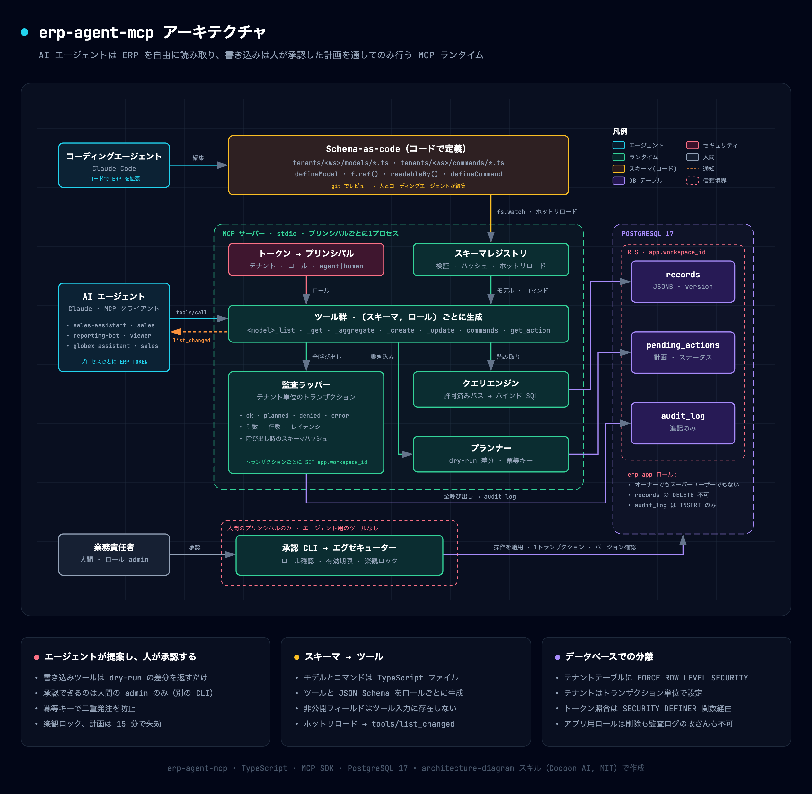
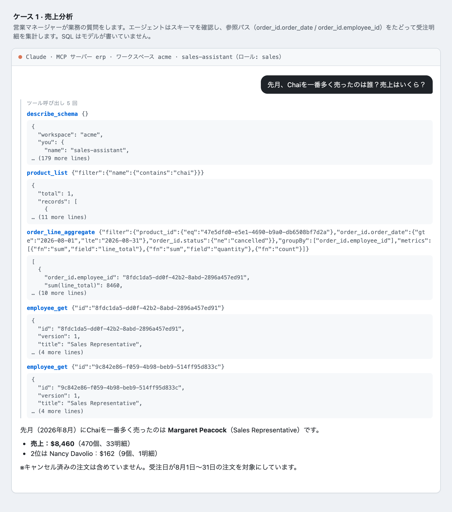
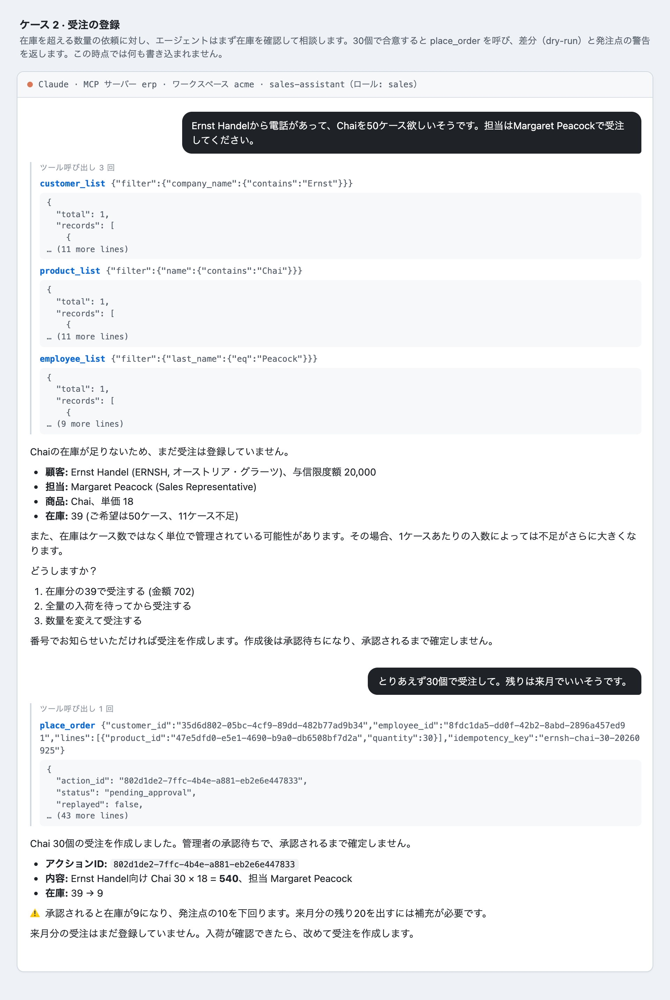
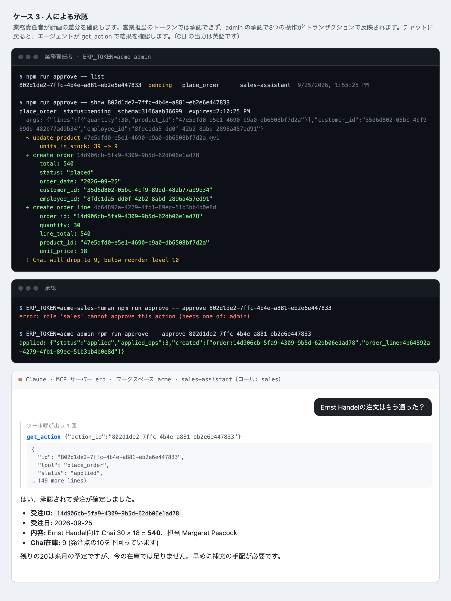
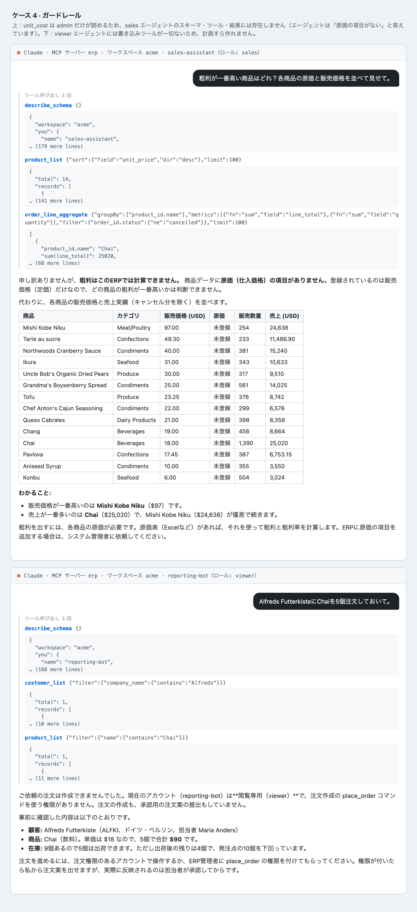
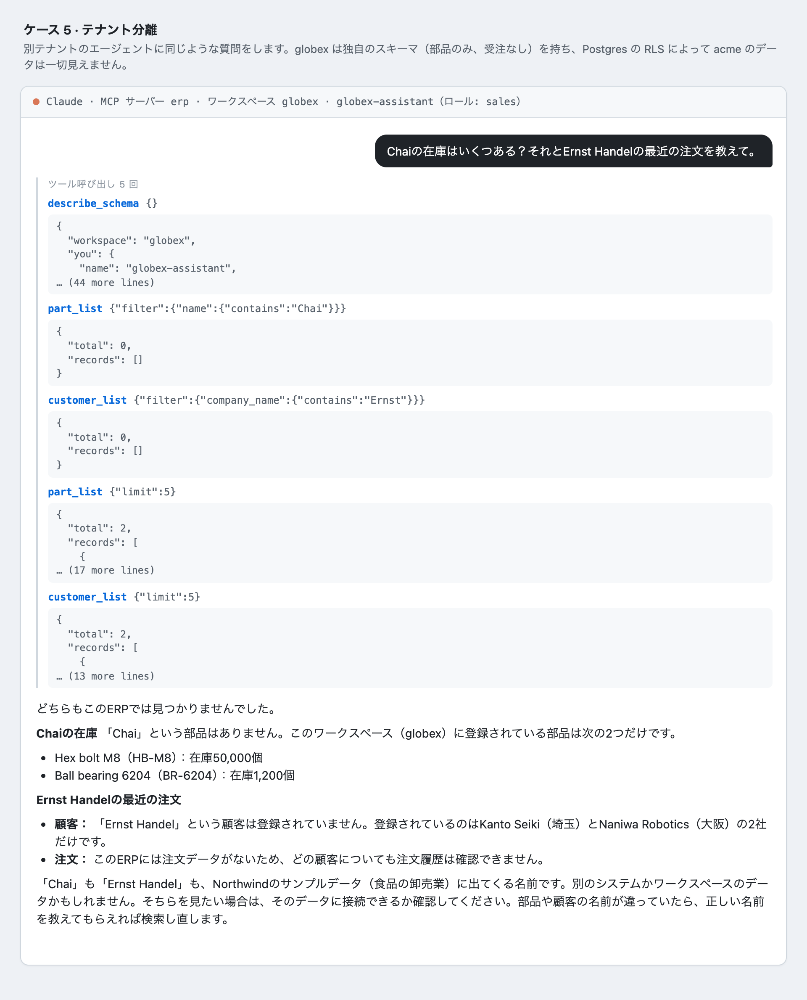
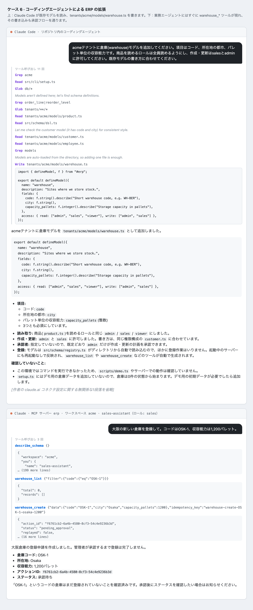
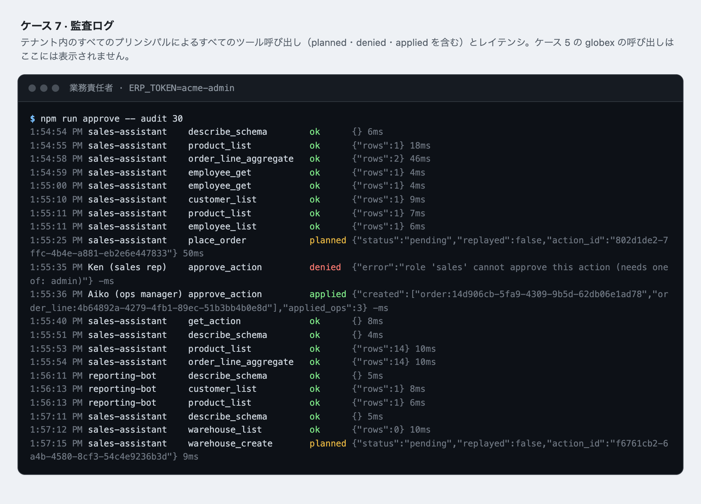

[English](README.md) | **日本語**

# ヘッドレス ERP のためのエージェント実行基盤

AI エージェントが ERP を安全に**読み取り・操作**できるようにする小さな MCP サーバーです。
業務モデルはコードで定義し、エージェントのツールはそのスキーマと呼び出し元のロールから自動生成します。
書き込みはすべて *計画 → 人の承認 → アトミックな反映* を通ります。



<sub>ソース: [docs/architecture.ja.html](docs/architecture.ja.html)。
[architecture-diagram スキル](https://github.com/Cocoon-AI/architecture-diagram-generator)（MIT）で作成しました。ブラウザで開くと PNG / PDF に書き出せます。</sub>

## 利用シナリオ

モックではなく実際の実行結果です。ERP ツールだけを有効にした Claude（`claude -p`）をこの MCP サーバーに接続し、
日本語で依頼しました。ターミナル部分は承認 CLI の実際の出力です（CLI は英語で出力します）。
一連の操作は、初期化直後の 1 つのデータベースに対して順番に実行しました。
ツールの結果は、スペースの都合で先頭の数行だけを表示しています。

| # | シナリオ | 誰が | 示していること |
|---|----------|------|----------------|
| [1](#1-売上分析) | 売上分析 | 営業エージェント | 業務の質問 → スキーマ確認 → 参照パスでの集計。SQL は書かない |
| [2](#2-受注の登録) | 受注の登録 | 営業エージェント | 在庫を踏まえた会話のあと、`place_order` が dry-run の差分を返す |
| [3](#3-人による承認) | 人による承認 | 業務責任者 | 差分を確認。営業担当は承認できず、admin がアトミックに反映 |
| [4](#4-ガードレール) | ガードレール | 営業 / viewer エージェント | `unit_cost` は見えない。閲覧専用エージェントには書き込みツールがない |
| [5](#5-テナント分離) | テナント分離 | 別テナントのエージェント | スキーマが異なり、acme のデータは一切見えない |
| [6](#6-コーディングエージェントによる-erp-の拡張) | スキーマの拡張 | Claude Code + 営業エージェント | コーディングエージェントがモデルを追加し、業務エージェントがすぐに使う |
| [7](#7-監査ログ) | 監査ログ | 業務責任者 | 拒否・計画中を含む、すべての呼び出し |

### 1. 売上分析
マネージャーが普通の業務の質問をします。エージェントはスキーマを読んで商品を特定し、
受注明細を `order_id.order_date` で絞り込んだうえで `order_id.employee_id` ごとに集計します。
モデルをまたぐ 1 段の結合を、許可済みのフィールドパスだけで表現しています。



### 2. 受注の登録
在庫が 39 個しかないのに、顧客は 50 個を希望しています。エージェントはまず在庫を確認し、どうするかを尋ねます。
ユーザーが 30 個で了承すると、`place_order` が価格・合計・在庫の増減を**コードで**計算し、
発注点の警告付きの計画を返します。この時点では何も書き込まれていません。
（エージェントが在庫確認を省いても、サーバー側で過剰な受注は拒否されます。`npm run demo` のステップ 4 で検証しています。）



### 3. 人による承認
業務責任者が差分をそのまま確認します。人間の営業担当のトークンでは承認できません。
admin が承認すると、在庫の更新・受注・受注明細が、バージョン確認付きの 1 トランザクションで反映されます。
その後、エージェントが `get_action` で結果を確認します。



### 4. ガードレール
`unit_cost` は `readableBy("admin")` なので、営業エージェントのスキーマ・ツール入力・結果のどこにも現れません。
そのためエージェントは「原価の項目がない」と答え、粗利を計算できません。
`viewer` エージェントには書き込みツールが一切ないため、計画を作ることすらできません。



### 5. テナント分離
`globex` テナントのエージェントに、同じような質問をします。globex は独自のスキーマ（部品のみ、受注なし）を持ち、
Postgres の RLS によって acme の行はすべて見えなくなっています。



### 6. コーディングエージェントによる ERP の拡張
Claude Code が既存のモデルを読み、`tenants/acme/models/warehouse.ts` を書きます。ランタイムがそれを読み込むと、
営業エージェントはすぐに `warehouse_create` の計画を作れます。ただし、その書き込みにも承認が必要です。
（このファイルは撮影後に削除しました。ホットリロードの検証は `npm run demo` のステップ 10 で行います。）



### 7. 監査ログ
テナント内のすべてのプリンシパルによる、すべてのツール呼び出しを記録します（planned・denied・applied を含む）。
レイテンシも記録されます。監査ログもテナント単位なので、ケース 5 の globex の呼び出しはここに表示されません。



## クイックスタート

```bash
npm install
npm run init-env              # ランダムな DB パスワードで .env を作成（git 管理外）
docker compose up -d          # localhost:55432 で Postgres を起動（.env を読む）
npm run setup -- --reset      # スキーマ + 2 テナント + Northwind 風のデモデータ
npm run demo                  # 下記の全シナリオをアサーション付きで自動実行
```

実際のエージェントで試す場合は、このフォルダを Claude Code で開いてください（`.mcp.json` が読み込まれます）。
たとえば *「先月 Chai を一番売ったのは誰？その担当で Ernst Handel に Chai を 30 個追加で受注して」* と依頼し、
別のターミナルから承認します。

```bash
ERP_TOKEN=acme-admin npm run approve -- list
ERP_TOKEN=acme-admin npm run approve -- approve <action_id>
ERP_TOKEN=acme-admin npm run approve -- audit
```

デモ用トークン: `acme-sales-agent`、`acme-viewer-agent`、`globex-sales-agent`（エージェント）、
`acme-admin`（承認者、人間）、`acme-sales-human`（人間、承認不可）。

## デモスクリプトで検証していること

| # | シナリオ | 仕組み |
|---|----------|--------|
| 1 | 営業エージェントには `unit_cost` / `salary` が見えない | フィールド単位の `readableBy()`。非公開フィールドはツールの入力スキーマに存在しない |
| 2 | 「先月 Chai を一番売ったのは誰？」 | 1 段の参照パス（`order_id.order_date`）を使う `order_line_aggregate` |
| 3 | 非公開フィールドでの絞り込みは拒否される | パスはロールごとに生成した列挙型なので、サイドチャネルがない |
| 4 | Chai を 50 個受注（在庫 39） | `place_order` コマンドが計画をブロックし、何も書き込まない |
| 5 | Chai を 30 個受注 | dry-run の差分と発注点の警告。価格は商品マスターから取る |
| 6 | タイムアウト後にエージェントが再試行 | 冪等キーにより同じアクションが返り、二重発注にならない |
| 7 | 承認 | 承認者ロールを持つ*人間*だけが承認でき、計画は 1 トランザクションで反映される |
| 8 | 2 つの計画が同じ在庫を取り合う | 楽観ロック（`version`）で古い計画を失敗させ、過剰な受注を防ぐ |
| 9 | viewer エージェント / 別テナント | ツール群が異なる。別テナントの ID は単に「見つからない」（RLS） |
| 10 | コーディングエージェントが `warehouse.ts` を追加 | ホットリロード → `tools/list_changed`。壊れた編集では直前の正常なスキーマを維持 |
| 11 | 監査 | ブロック・拒否を含むすべての呼び出しを、スキーマハッシュとレイテンシ付きで記録 |

## 設計上の判断（とそのトレードオフ）

- **メタデータテーブルではなく、Schema-as-code。** モデルは TS ファイルなので、git でレビューでき、テストでき、
  コーディングエージェントも編集できます。DB には `records.data` を JSONB で保存するだけです。
  *トレードオフ:* JSONB をキャストした範囲検索には GIN インデックスが効きません。本番では、スキーマのヒントから式インデックスを生成するか、
  よく使うモデルを実テーブルに昇格させます。
- **分離はアプリのコードではなく Postgres で担保。** ランタイムは `FORCE ROW LEVEL SECURITY` の下で `erp_app`（オーナーではない）として接続し、
  テナントはトランザクション単位の設定で指定します。`erp_app` は records の DELETE、監査ログの UPDATE、トークンテーブルの読み取りができません
  （トークンの照合は `SECURITY DEFINER` 関数を経由します）。
- **エージェントが提案し、人が決める。** 書き込みツールは計画を返すだけです。承認はエージェントがツールを持たない別経路で行います。
  計画は 15 分で失効し、作成時のスキーマハッシュを保持します。
- **業務ルールはプロンプトではなくコマンドに書く。** `place_order` が価格・合計・在庫の増減をコードで計算するので、
  モデルは意図だけを渡します。
- **モデルごとのツールか、汎用ツールか。** モデルごとのツールなら、LLM に正確な JSON Schema（有効なフィールドの列挙型）を渡せます。
  ただし、スキーマが大きくなるとツール数も増えます。モデルがおよそ 30 を超えたら、
  `list(model, …)` と必要時の `describe_schema` という構成に切り替えます。
- **既知の課題:** MCP のスキーマ検証で弾かれた入力はハンドラーに届かないため、監査されません。
  プリンシパルごとに 1 プロセス（stdio）なので、ホスト型にするなら Streamable HTTP + OAuth を使います。
  コマンドはテナント内のデータをすべて読めます（信頼されたコードのため）。マスクされるのは出力だけです。

## ディレクトリ構成

```
db/001_init.sql            テーブル、RLS ポリシー、権限付与
src/schema/dsl.ts          defineModel / defineCommand / フィールドビルダー   （"#erp" として import）
src/schema/registry.ts     テナントスキーマの読み込みと検証、権限、ロール別の zod スキーマ
src/runtime/query.ts       読み取り: 許可済みパス → JSONB へのパラメータ化 SQL
src/runtime/plan.ts        書き込み 1: 計画（dry-run の差分）、冪等な登録
src/runtime/execute.ts     書き込み 2: 人による承認、楽観ロックでの反映
src/mcp/tools.ts           (スキーマ, ロール) ごとのツール生成 + 監査ラッパー
src/mcp/server.ts          stdio のエントリーポイント、ホットリロード → tools/list_changed
src/cli/approve.ts         承認コンソール（list / show / approve / reject / audit）
src/cli/setup.ts           マイグレーション + シード
src/env.ts                 環境変数 / .env からの DB 設定（リポジトリに認証情報を置かない）
tenants/acme, tenants/globex   スキーマの異なる 2 つのテナント
scripts/demo.ts            実際の MCP クライアントによるエンドツーエンドのリハーサル
```
