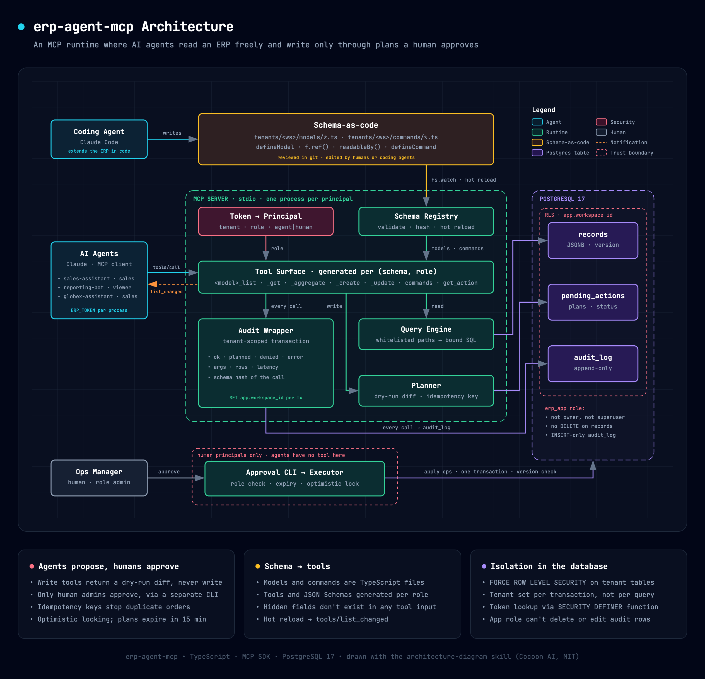
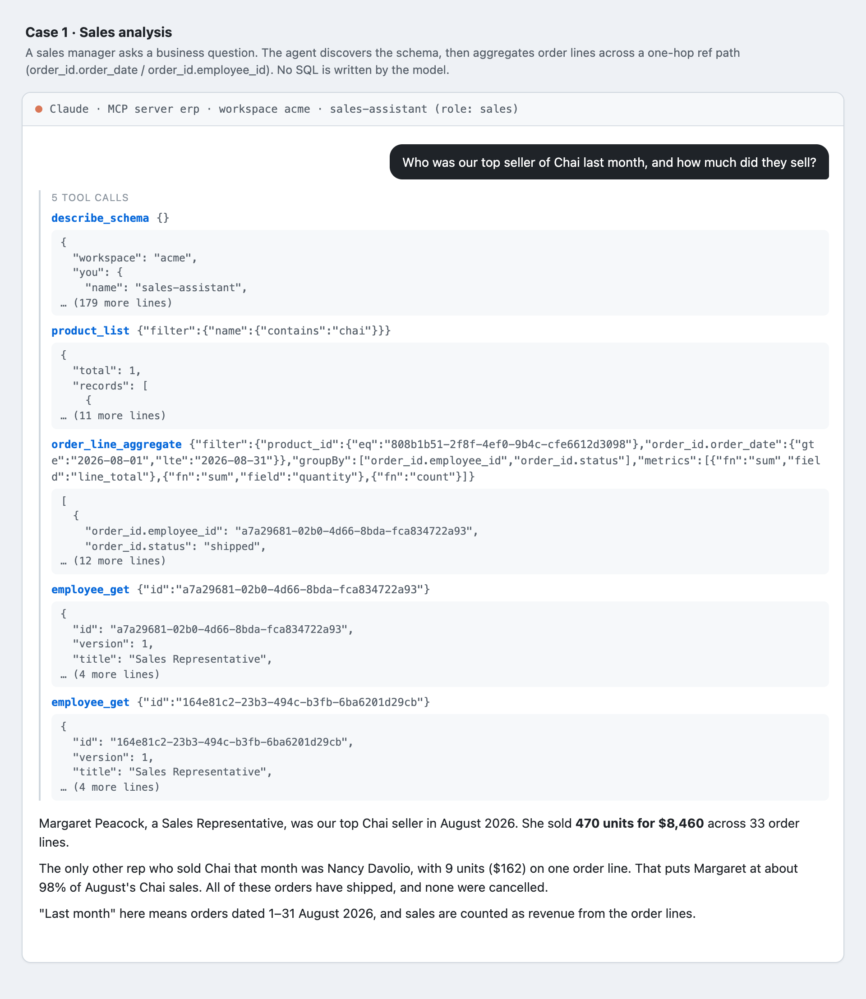
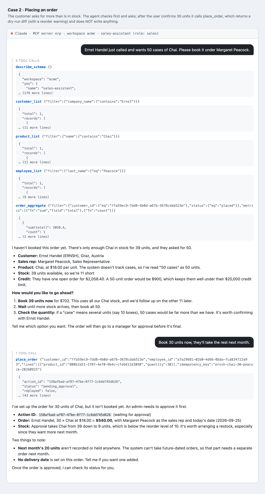
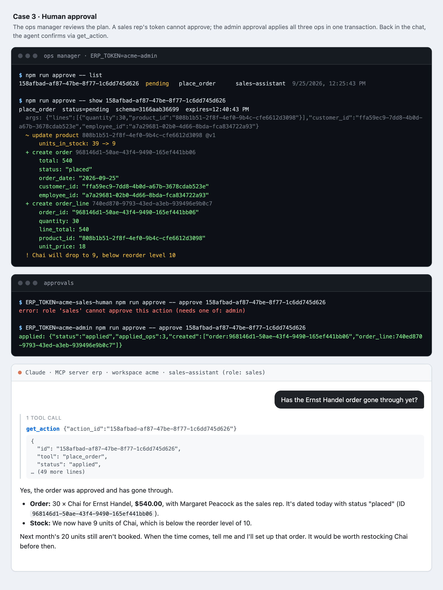
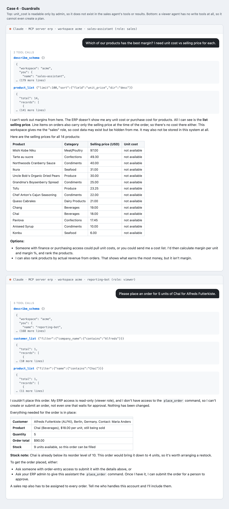
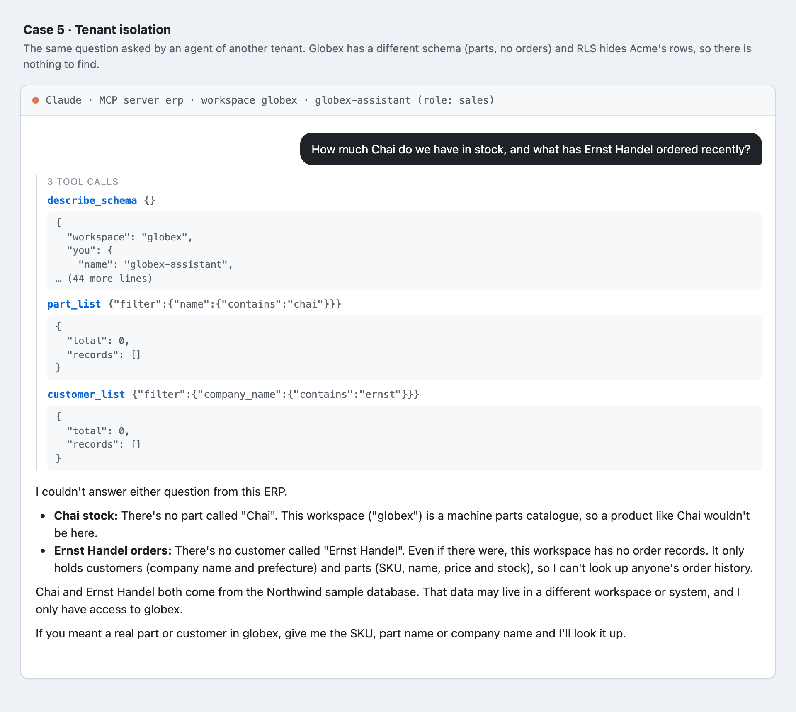
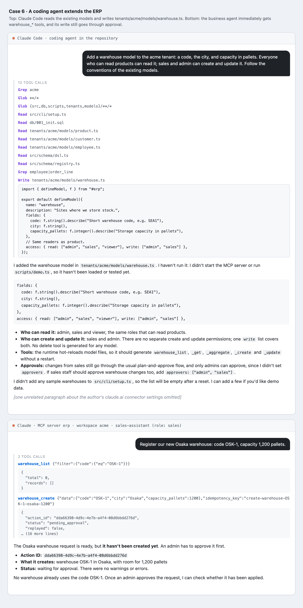
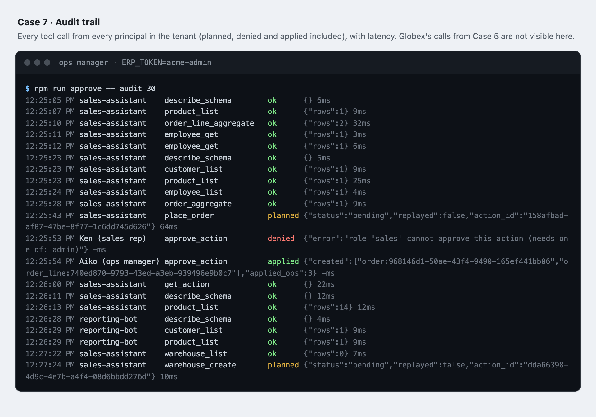

**English** | [日本語](README.ja.md)

# Agent execution runtime for a headless ERP

A small MCP server that lets AI agents **read and operate** an ERP safely.
Business models are defined as code; the agent's tools are generated from that schema and
from the caller's role, and every write goes through *plan → human approval → atomic apply*.



<sub>Source: [docs/architecture.html](docs/architecture.html), drawn with the
[architecture-diagram skill](https://github.com/Cocoon-AI/architecture-diagram-generator) (MIT). Open it in a browser to export PNG/PDF.</sub>

## Usage scenarios

These are real runs, not mock-ups: Claude (`claude -p`) is connected to this MCP server with
only the ERP tools enabled, and the terminals show real output from the approval CLI. The whole
sequence ran against one freshly seeded database. Tool results are cut to their first
lines to save space.

| # | Scenario | Who | What it shows |
|---|----------|-----|---------------|
| [1](#1-sales-analysis) | Sales analysis | sales agent | business question → schema discovery → aggregate over ref paths, no SQL |
| [2](#2-placing-an-order) | Placing an order | sales agent | stock-aware conversation, then `place_order` returns a dry-run diff |
| [3](#3-human-approval) | Human approval | ops manager | review the diff; a sales rep can't approve; admin applies atomically |
| [4](#4-guardrails) | Guardrails | sales / viewer agent | hidden `unit_cost`; a read-only agent has no write tools |
| [5](#5-tenant-isolation) | Tenant isolation | another tenant's agent | different schema, and none of Acme's data is visible |
| [6](#6-a-coding-agent-extends-the-erp) | Schema extension | Claude Code + sales agent | coding agent adds a model; business agent uses it right away |
| [7](#7-audit-trail) | Audit trail | ops manager | every call, including denied and planned ones |

### 1. Sales analysis
A manager asks a plain business question. The agent reads the schema, finds the product, and
aggregates order lines by `order_id.employee_id` over `order_id.order_date`. That is a one-hop
join across models, expressed through whitelisted field paths.



### 2. Placing an order
The customer asks for 50 units while only 39 are in stock. The agent checks first and asks what
to do. After the user confirms 30 units, `place_order` computes price, total and stock movement
**in code** and returns a plan with a reorder warning. Nothing is written yet.
(The server also rejects an oversell on its own, even when an agent skips the check. `npm run demo` step 4 covers that.)



### 3. Human approval
The ops manager reviews the exact diff. A human sales rep's token is refused. The admin's approval
applies the stock update, the order and the order line in one transaction, with a version check.
The agent then confirms the result through `get_action`.



### 4. Guardrails
`unit_cost` is `readableBy("admin")`, so it is missing from the sales agent's schema, tool
inputs and results, and the agent says it cannot compute margins. A `viewer` agent gets no write tools
at all, so it cannot even create a plan.



### 5. Tenant isolation
The same kind of question from an agent in the `globex` tenant. Globex has its own schema
(parts, no orders), and Postgres RLS hides every Acme row.



### 6. A coding agent extends the ERP
Claude Code reads the existing models and writes `tenants/acme/models/warehouse.ts`. The runtime
loads it, and the sales agent can immediately plan a `warehouse_create`, which still needs approval.
(This file was removed again afterwards; `npm run demo` step 10 recreates it to test hot reload.)



### 7. Audit trail
Every tool call by every principal in the tenant, including planned, denied and applied ones,
with latency. Globex's calls from case 5 are absent because the audit log is tenant-scoped too.



## Quick start

```bash
npm install
npm run init-env              # creates .env with random DB passwords (git-ignored)
docker compose up -d          # Postgres on localhost:55432, reads .env
npm run setup -- --reset      # schema + two tenants + Northwind-style demo data
npm run demo                  # scripted end-to-end run of every scenario below, with assertions
```

To use it with a real agent, open this folder in Claude Code (it picks up `.mcp.json`), then ask e.g.
*"Who sold the most Chai last month? Then order 30 more Chai for Ernst Handel under that rep."*
Approve from another terminal:

```bash
ERP_TOKEN=acme-admin npm run approve -- list
ERP_TOKEN=acme-admin npm run approve -- approve <action_id>
ERP_TOKEN=acme-admin npm run approve -- audit
```

Demo tokens: `acme-sales-agent`, `acme-viewer-agent`, `globex-sales-agent` (agents),
`acme-admin` (human approver), `acme-sales-human` (human, cannot approve).

## What the demo shows

| # | Scenario | Mechanism |
|---|----------|-----------|
| 1 | Sales agent never sees `unit_cost` / `salary` | field-level `readableBy()`; hidden fields are absent from tool input schemas |
| 2 | "Who sold the most Chai last month?" | `order_line_aggregate` with one-hop ref paths (`order_id.order_date`) |
| 3 | Filtering on a hidden field is rejected | paths are an enum generated per role, so there's no side channel |
| 4 | Ordering 50 Chai (stock 39) | `place_order` command blocks the plan and nothing is written |
| 5 | Ordering 30 Chai | dry-run diff + reorder-level warning; prices come from the product master |
| 6 | Agent retries after a timeout | idempotency key returns the same action, so there's no double order |
| 7 | Approval | only a *human* with an approver role; plan applied in one transaction |
| 8 | Two plans race for the same stock | optimistic lock (`version`) fails the stale one instead of overselling |
| 9 | Viewer agent / other tenant | different tool surface; other tenant's ids are simply "not found" (RLS) |
| 10 | Coding agent adds `warehouse.ts` | hot reload → `tools/list_changed`; a broken edit keeps the last good schema |
| 11 | Audit | every call, including blocked and denied ones, with schema hash and latency |

## Design decisions (and their trade-offs)

- **Schema-as-code, not metadata tables.** Models are TS files: reviewable in git, testable,
  and a coding agent can edit them. The DB stores only `records.data` as JSONB.
  *Trade-off:* range filters on JSONB casts don't use the GIN index; production would generate
  expression indexes from schema hints or promote hot models to real tables.
- **Isolation lives in Postgres, not app code.** The runtime connects as `erp_app` (not the owner) with
  `FORCE ROW LEVEL SECURITY`; the tenant is a transaction-local setting. `erp_app` cannot
  DELETE records, UPDATE the audit log, or read the token table (lookup goes through a `SECURITY DEFINER` function).
- **Agents propose, humans dispose.** Write tools return a plan. Approval is a separate channel the
  agent has no tool for. Plans expire after 15 minutes and carry the schema hash they were computed against.
- **Business rules are commands, not prompts.** `place_order` computes prices, totals and stock
  movements in code, so the model supplies only intent.
- **Tools per model vs. generic tools.** Per-model tools give the LLM precise JSON Schemas (enums of
  valid fields), but the tool count grows with the schema. Beyond roughly 30 models I'd switch to
  `list(model, …)` plus on-demand `describe_schema`.
- **Known gaps:** inputs rejected by MCP schema validation never reach the handler, so they aren't audited.
  There's one process per principal (stdio), where a hosted version would use Streamable HTTP + OAuth.
  Commands read with full tenant visibility (trusted code), and only their output is masked.

## Layout

```
db/001_init.sql            tables, RLS policies, grants
src/schema/dsl.ts          defineModel / defineCommand / field builders   (imported as "#erp")
src/schema/registry.ts     load + validate tenant schema, permissions, per-role zod schemas
src/runtime/query.ts       read path: whitelisted paths → parameterized SQL over JSONB
src/runtime/plan.ts        write path 1: plan (dry-run diff), idempotent submission
src/runtime/execute.ts     write path 2: human approval, optimistic-lock apply
src/mcp/tools.ts           tool generation per (schema, role) + audit wrapper
src/mcp/server.ts          stdio entry, hot reload → tools/list_changed
src/cli/approve.ts         approver console (list / show / approve / reject / audit)
src/cli/setup.ts           migrate + seed
src/env.ts                 DB settings from env / .env (no credentials in the repo)
tenants/acme, tenants/globex   two tenants with different schemas
scripts/demo.ts            end-to-end rehearsal via a real MCP client
```
